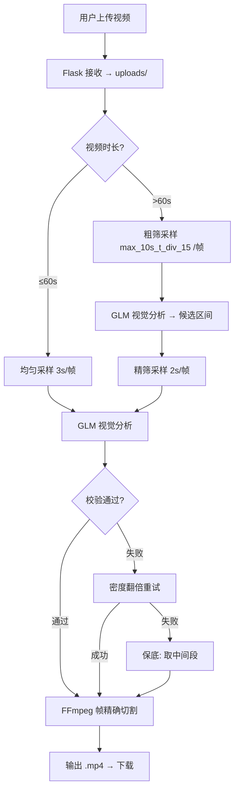
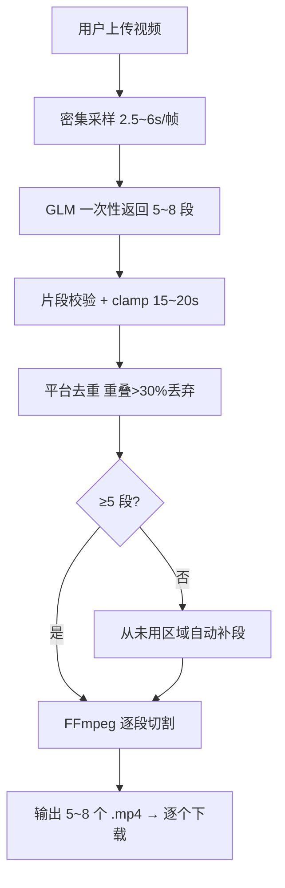

# YouTube 视频雷达 — 智能剪辑工具

> 上传视频 → AI 视觉理解 → 自动剪辑 → 输出可下载短视频

[](https://python.org)
[](https://flask.palletsprojects.com/)
[](https://open.bigmodel.cn/)

---

## 项目定位

面向社交媒体内容生产者（YouTube/Facebook/TikTok）的智能剪辑工具。上传长视频 + 一段自然语言描述，系统自动定位最匹配的视频片段并输出可直接发布的短视频。

**核心差异化：** 基于视觉理解而非字幕文本匹配——模型真正"看"视频画面来理解内容，对无字幕/外语视频同样有效。

---

## 架构

```
┌─────────────────────────────────────────────────────────────┐
│                        Frontend (HTML/CSS/JS)                │
│  ┌──────────┐  ┌──────────┐  ┌──────────┐  ┌────────────┐  │
│  │ URL 提交  │  │ 字幕剪辑  │  │ 素材雷达  │  │ CLIP V2    │  │
│  │  (Tab 1)  │  │  (Tab 2)  │  │  (Tab 3)  │  │ 上传剪辑   │  │
│  └────┬─────┘  └────┬─────┘  └────┬─────┘  └─────┬──────┘  │
│       │            │            │            │              │
│       ▼            ▼            ▼            ▼              │
│  ┌──────────────────────────────────────────────────────┐   │
│  │                  Flask API Layer                      │   │
│  │  /api/clip    /api/radar    /api/clip_v2 (single|batch) │   │
│  └───────┬───────────────────────────────┬──────────────┘   │
│          │                               │                   │
│          ▼                               ▼                   │
│  ┌──────────────┐              ┌────────────────────┐       │
│  │  V1: 文本分析 │              │  V2: 视觉理解       │       │
│  │  Qwen-Plus   │              │  GLM-4.6V-Flash    │       │
│  │  字幕→JSON   │              │  帧采样→base64→GLM │       │
│  └──────┬───────┘              └─────────┬──────────┘       │
│         │                                │                   │
│         ▼                                ▼                   │
│  ┌──────────────────────────────────────────────────────┐   │
│  │              Video Processor (FFmpeg)                  │   │
│  │  帧精确切割 / 格式转码 / 文件管理 / 24h自动清理        │   │
│  └──────────────────────────────────────────────────────┘   │
└─────────────────────────────────────────────────────────────┘
```

### 数据流（V2 单视频模式）



### 数据流（V2 批量模式）



---

## 技术亮点

### 1. 视觉理解替代文本匹配

传统方案依赖 YouTube 字幕做关键词匹配（V1），对无字幕/外语视频/画面为主的内容无效。V2 采用 **GLM-4.6V-Flash** 直接分析视频帧，理解表情变化、场景氛围、文字标题等视觉线索。

### 2. Token 成本优化（~10x 降低）

| 方案 | Token 消耗 | 延迟 |
|------|-----------|------|
| 直接传视频 URL | ~70,000 | 20~75s |
| **本地帧采样 + base64** | **~5,000** | **5~13s** |

每帧缩放至 640px、JPEG 70% 质量，15~20 帧总计约 1~2MB。

### 3. 三级降级容错

```
第1轮（正常采样）→ 失败?
第2轮（密度翻倍重试）→ 失败?
第3轮（中间段保底，永不抛异常）
```

根因修复：发现并修复了时间戳未传递给 GLM 的死代码 Bug——原代码生成了时间戳 prompt 但丢弃变量，GLM 实际只看裸图猜时间。

### 4. 批量剪辑 + 平台级去重

一次调用产出 5~8 段互不雷同的短视频，去重标准对齐 FB/TikTok 平台判定（重叠 >30% 丢弃，≤30% 修剪），不足 5 段时自动从未用区域补段。

### 5. FFmpeg 帧精确切割

- 帧精确模式（重编码 H.264 + AAC）
- 自动定位 ffmpeg.exe（PATH → winget 目录 → fallback）
- 文件 24h 自动清理
- `-map 0:a?` 兼容无音轨视频

---

## 技术栈

| 层 | 技术 |
|----|------|
| 后端框架 | Python 3.10+ / Flask |
| 视觉理解 | GLM-4.6V-Flash (智谱 API) |
| 文本理解 | Qwen-Plus (百炼 API，V1) |
| 帧提取 | OpenCV (opencv-python-headless) |
| 视频处理 | FFmpeg 8.x |
| 前端 | 原生 HTML/CSS/JS (无框架) |
| 版本控制 | Git (dev 分支开发，master 稳定) |

---

## 快速开始

```bash
# 1. 安装依赖
pip install -r requirements.txt

# 2. 配置 API Key
# 编辑 config.py，填写：
#   GLM_API_KEY = "your-glm-key"
#   DASHSCOPE_API_KEY = "your-qwen-key"

# 3. 确保 FFmpeg 已安装（脚本自动定位）
# 或手动安装: winget install Gyan.FFmpeg

# 4. 启动服务
python app.py

# 5. 访问
# http://localhost:5000
```

---

## API

### V2 视觉剪辑

```http
POST /api/clip_v2
Content-Type: multipart/form-data

# 单视频模式
video: <file>
description: "找精彩片段"
duration: 20          # 15|20|25|30
mode: "single"

# 批量模式
video: <file>
description: "找精彩片段"
mode: "batch"
```

### V1 文本剪辑

```http
POST /api/clip
Content-Type: application/json

{"url": "youtube-url", "description": "找精彩片段"}
```

| API | 方法 | 输入 | 输出 |
|-----|------|------|------|
| `/api/clip` | POST | YouTube URL + 描述 | JSON 时间戳 |
| `/api/clip_v2` | POST | 视频文件 + 描述 + mode | 1 个或 5~8 个 .mp4 |
| `/api/clip_v2/download/<filename>` | GET | 文件名 | .mp4 文件 |
| `/api/radar` | POST | 关键词列表 | 视频搜索结果 |

---

## 目录结构

```
youtube-video-radar/
├── app.py                    # Flask 主应用 + 路由
├── config.py                 # API Key、路径、剪辑参数
├── requirements.txt          # Python 依赖
├── services/
│   ├── vision_clipper.py     # GLM 视觉理解 + 帧采样 + 容错
│   ├── clipper.py            # V1 字幕文本分析（Qwen）
│   ├── video_processor.py    # FFmpeg 切割 + 文件管理 + 自动定位
│   ├── keyword.py            # 关键词提炼
│   ├── filter.py             # 视频筛选
│   └── copy_writer.py        # 文案生成
├── uploads/                  # 上传文件（24h 自动清理）
├── outputs/clips/            # 剪辑输出
└── index.html                # 前端 UI（4 个 Tab）
```

---

## 版本演进

| 版本 | 时间 | 核心变更 |
|------|------|---------|
| V1 | 2026-05 | YouTube URL → 字幕文本分析（Qwen）→ JSON 时间戳 |
| V2 | 2026-06 | 用户上传视频 → 视觉理解（GLM-4.6V-Flash）→ 可下载 .mp4 |
| V2.1 | 2026-06 | 批量模式：一次 5~8 段 + 去重 + 补段 + 三级容错 |

---

## 已知限制与下一步

- GLM 视觉模型对政治敏感画面审核严格，普通素材不受影响
- 批量模式采样覆盖长视频的间隔仍可优化（当前 step 下限 2.5s）
- 后续可引入 GLM 返回结果置信度评分，低分时主动降级提示
